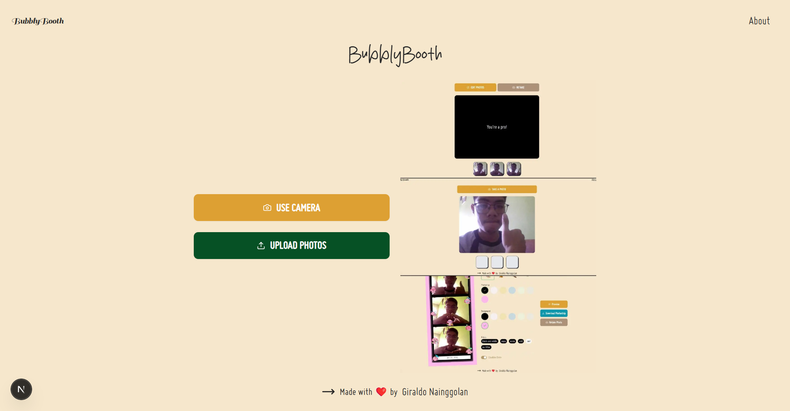

This is a [Next.js](https://nextjs.org) project bootstrapped with [`create-next-app`](https://nextjs.org/docs/app/api-reference/cli/create-next-app).

<div align="center">

  
  <h1>Awesome Readme Template For Repo</h1>
  
  <p>
    An awesome README template for your projects! 
  </p>
  
  
<!-- Badges -->
<p>
  <a href="https://github.com/GiraldoNainggolan/Photo-Booth/graphs/contributors">
    
  </a>
  <a href="">
    
  </a>
  <a href="https://github.com/GiraldoNainggolan/Photo-Booth/network/members">
    
  </a>
  <a href="https://github.com/GiraldoNainggolan/Photo-Booth/stargazers">
    
  </a>
  <a href="https://github.com/GiraldoNainggolan/Photo-Booth/issues/">
    
  </a>
  <a href="https://github.com/GiraldoNainggolan/Photo-Booth/blob/master/LICENSE">
    
  </a>
</p>
   
<h4>
    <a href="https://github.com/GiraldoNainggolan/Photo-Booth">View Demo</a>
  <span> · </span>
    <a href="https://github.com/GiraldoNainggolan/Photo-Booth">Documentation</a>
  <span> · </span>
    <a href="https://github.com/GiraldoNainggolan/Photo-Booth/issues/">Report Bug</a>
  <span> · </span>
    <a href="https://github.com/GiraldoNainggolan/Photo-Booth/issues/">Request Feature</a>
  </h4>
</div>

<br />



## Getting Started

First, run the development server:

```bash
npm install
# or
npm install --legacy-peer-deps
# or
npm run dev
# or
yarn dev
# or
pnpm dev
# or
bun dev
```

Open [http://localhost:3000](http://localhost:3000) with your browser to see the result.

You can start editing the page by modifying `app/page.tsx`. The page auto-updates as you edit the file.

This project uses [`next/font`](https://nextjs.org/docs/app/building-your-application/optimizing/fonts) to automatically optimize and load [Geist](https://vercel.com/font), a new font family for Vercel.

## Learn More

To learn more about Next.js, take a look at the following resources:

- [Next.js Documentation](https://nextjs.org/docs) - learn about Next.js features and API.
- [Learn Next.js](https://nextjs.org/learn) - an interactive Next.js tutorial.

You can check out [the Next.js GitHub repository](https://github.com/vercel/next.js) - your feedback and contributions are welcome!

## Deploy on Vercel

The easiest way to deploy your Next.js app is to use the [Vercel Platform](https://vercel.com/new?utm_medium=default-template&filter=next.js&utm_source=create-next-app&utm_campaign=create-next-app-readme) from the creators of Next.js.

Check out our [Next.js deployment documentation](https://nextjs.org/docs/app/building-your-application/deploying) for more details.
